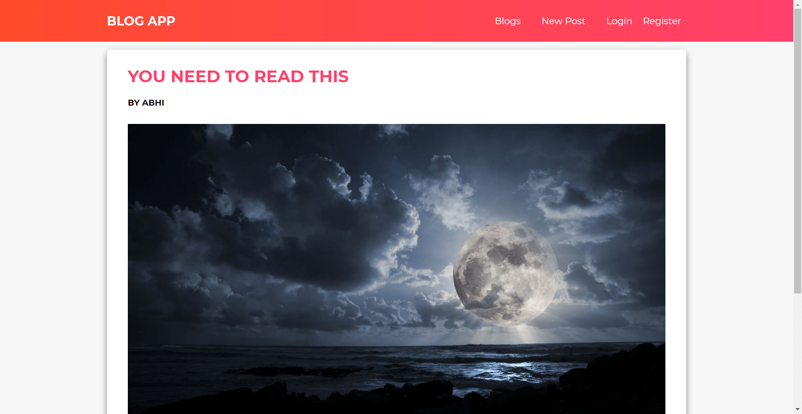

# Blog App

## Screenshots

Home Page

View Post Page

Login Page

Registeration Page

View Post Page After Logged In

New Post Page

Edit Post Page

## Description

- This project is one of my portfolio projects.
- This is written in <b>REACT</b>.
- State Management used is <b>REDUX</b> and <b>Redux Toolkit</b>.
- The backend used is [Blog API](https://github.com/Abhi-codr/blog-app-api).
